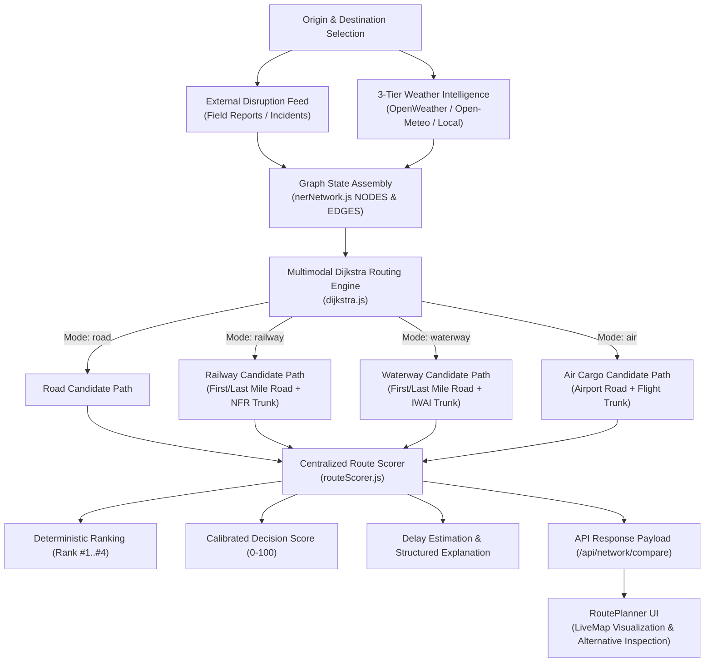

# NER-SAHAYAK — Phase 2 Implementation Report
## Intelligent Routing & Alternatives Engine

**Program**: AI-Based Smart Logistics and Accessibility Intelligence Platform for North Eastern Region (NER)  
**Implementation Stage**: Phase 2 — Complete  
**Engine Description**: Deterministic Risk-Weighted Disruption Intelligence Engine  
**Branch**: `ner-sahayak-hackathon`  
**Date**: September 2026  

---

## 1. Executive Summary

Phase 2 strengthens, hardens, and validates the complete intelligent routing and multimodal alternative generation pipeline of NER-SAHAYAK. Operating in the hazardous, mountainous terrain of Northeast India—where torrential monsoons, landslides, flash floods, and bridge washouts frequently paralyze arterial highways—NER-SAHAYAK provides deterministic, auditable, and life-critical logistics routing.

Rather than making unsupported claims of black-box machine learning models, NER-SAHAYAK implements an industrial-grade **Deterministic Risk-Weighted Disruption Intelligence Engine**. It unifies:
1. Multi-modal graph topology modeling Road (Highways), Rail (Northeast Frontier Railway), Inland Waterways (IWAI National Waterways NW-2 and NW-16), and Air Cargo corridors.
2. A 3-stage state-machine Dijkstra routing algorithm that enforces realistic physical freight transfer patterns: $\text{Origin} \to \text{Road First-Mile} \to \text{Trunk Mode} \to \text{Road Last-Mile} \to \text{Destination}$.
3. Disruption and weather risk compounding that dynamically degrades corridor accessibility from `OPEN` to `CAUTION` ($2.0\times$), `RESTRICTED` ($5.0\times$), `SEVERELY_DISRUPTED` ($15.0\times$), and `BLOCKED` ($\infty$).
4. A centralized, authoritative composite cost and recommendation engine (`routeScorer.js`) that produces deterministic rankings (Rank #1, #2, #3, #4), calibrated non-probability Decision Scores ($0-100$), transparent natural-language rationales, and structured explanation payloads.
5. Explicit delay estimation metrics contrasting clear baseline duration against disruption-adjusted travel time (`baseDurationMinutes`, `estimatedDelayMinutes`).
6. Complete offline parity in the client-side fallback router (`routeCalculator.js`).

All 16 required verification tests in `backend/test_phase2_routing.js` pass with 100% success, alongside 100% pass rates across Phase 1 tests, architectural routing suites, multimodal matrix regression tests (36/36), and network connectivity benchmarks (600/600 pairs).

---

## 2. Problem Statement & Objectives

### The Northeast India Logistics Challenge
The North Eastern Region (NER) is connected to mainland India solely through the narrow 22-kilometer Siliguri Corridor ("Chicken's Neck"). Within the 8 northeastern states (Assam, Meghalaya, Arunachal Pradesh, Nagaland, Manipur, Mizoram, Tripura, and Sikkim), logistics corridors traverse unstable seismic zones, young fold mountains, and river basins prone to Brahmaputra and Barak flooding. A single landslide on NH27 or NH6 can sever food, medical supplies, and critical cargo for days.

### Core Objectives
1. **Single Source of Truth**: Enforce `backend/utils/routeScorer.js` as the sole arbiter of route ranking, comparison, and recommendation.
2. **Deterministic Ranking**: Guarantee strict sequential ranking ($1, 2, 3, 4$) without gaps or ambiguous ties (`Rank #—`).
3. **Calibrated Decision Score**: Provide a presentation-only Decision Score ($0-100$) that reflects relative composite cost without ever misrepresenting itself as a probability or distorting ranking order.
4. **Structured & Textual Explainability**: Produce detailed operational rationales explaining why the recommended mode was selected over specific alternatives (e.g. road landslide on NH27 causing safety to drop to 55% and transit time to jump to 19 hours).
5. **Exact Delay Derivation**: Calculate base transit duration vs disruption-adjusted transit duration and surface `estimatedDelayMinutes` on routes and segments.
6. **Network Isolation**: Guarantee that road hazards never pollute rail, waterway, or air corridor safety.
7. **Offline Capability**: Maintain identical scoring, delay estimation, and explanation generation in client-side offline routing.

---

## 3. Routing Engine Architecture

The routing pipeline follows an end-to-end deterministic data flow:



---

## 4. Dijkstra Algorithm & Cost Function

### Graph Representation
The network graph is defined in `backend/data/nerNetwork.js` across 25 regional nodes, 11 dedicated airport cargo hubs, and 48 arterial edges across all 4 modes.

### Edge Cost Function
Edge traversal cost in Dijkstra routing represents physical resistance, prioritizing safety and operational continuity over raw geometric distance:

$$W(e) = \text{baseWeight} \times M_{\text{weather}}(e) \times M_{\text{disruption}}(e)$$

Where:
- $\text{baseWeight} = \text{km} \times \text{terrainFactor}$
- $\text{terrainFactor} \in [1.0, 2.2]$ models mountain gradients, road curvature, and high-altitude passes.
- $M_{\text{weather}}(e) = 1 + (\text{weatherSeverity})^2 \times 8.0$
- $M_{\text{disruption}}(e)$ is the dynamic multiplier derived from active field reports.

If an edge is flagged as physically blocked or suffering bridge failure, $W(e) = \infty$, forcing the pathfinder to seek legal bypasses or terminate cleanly.

### 3-Stage Multimodal State Machine
To model multimodal routes realistically, the graph traversal tracks state triples $(u, s)$, where $u$ is the node and $s \in \{0, 1, 2\}$ is the transit stage:
- **Stage 0 (First-Mile Access)**: Road transport from origin to modal hub/station/port.
- **Stage 1 (Main Trunk)**: Target mode transit (NFR broad-gauge rail, IWAI river barge, or scheduled air cargo flight).
- **Stage 2 (Last-Mile Egress)**: Road transport from arrival station/port to final destination.

This prevents unrealistic mode thrashing (e.g. jumping back and forth between rail and river).

---

## 5. Penalty & Disruption Mechanics

Active incident reports logged by field officers or administrative dispatchers map directly into discrete accessibility states and routing multipliers:

| Severity Classification | Multiplier $M_{\text{disruption}}$ | Normalized Accessibility State | Operational Meaning |
|:------------------------|:----------------------------------:|:------------------------------:|:--------------------|
| `minor` / `low`         | $2.0\times$                        | `CAUTION`                      | Potholes, light waterlogging, shoulder erosion. Minor delay. |
| `moderate` / `medium`   | $5.0\times$                        | `RESTRICTED`                   | Single-lane landslide, heavy mud, convoy-only movement. |
| `severe` / `major`      | $15.0\times$                       | `SEVERELY_DISRUPTED`           | Major landslide, washed-out approach, severe structural risk. |
| `blocked` / `critical`  | $\infty$                           | `BLOCKED`                      | Complete road collapse, bridge damage, impassable barrier. |

### Segment Speed Degradation
Segment transit times degrade based on physical resistance:
$$\text{effectiveSpeed} = \max\left(12, \frac{\text{baseSpeed}}{\sqrt{M_{\text{disruption}} \times \max(1, \text{weatherSeverity} \times 2)}}\right)$$
- Base road speed: $45\text{ km/h}$
- Base rail speed: $55\text{ km/h}$
- Base waterway speed: $24\text{ km/h}$
- Base air cargo speed: $500\text{ km/h}$

---

## 6. Weather Integration & Risk Compounding

Weather severity scores ($S_{\text{weather}} \in [0.0, 1.0]$) from the 3-Tier Weather Provider compound multiplicatively with physical incident reports:

$$M_{\text{total}} = M_{\text{weather}} \times M_{\text{disruption}}$$

**Example from Test 7**:
- Weather severity at Nagaon node: $0.50$
- $M_{\text{weather}} = 1 + (0.50)^2 \times 8.0 = 1 + 2.0 = 3.0\times$
- Moderate landslide on NH27: $M_{\text{disruption}} = 5.0\times$
- Compound multiplier: $3.0 \times 5.0 = 15.0\times$
- Base weight ($117\text{ km} \times 1.05 = 122.85$) scales to $122.85 \times 15.0 = 1,842.75$

Crucially, weather does not overwrite field reports, and field reports do not overwrite weather telemetry; both signals coexist and compound cleanly.

---

## 7. Multimodal Transportation Network

NER-SAHAYAK evaluates 4 modes simultaneously for any origin-destination pair:

```
+-------------------------------------------------------------------------------+
| MULTIMODAL LOGISTICS NETWORK SUMMARY                                          |
+-------------------------------------------------------------------------------+
| Mode      | Corridor Infrastructure       | Base Speed | Payload Focus         |
+-----------+-------------------------------+------------+-----------------------+
| ROAD      | National Highways (NH27, NH6) | 45 km/h    | General / Flexible    |
| RAILWAY   | Northeast Frontier Rail (NFR) | 55 km/h    | Bulk Freight / Heavy  |
| WATERWAY  | IWAI Rivers (NW-2 Brahmaputra)| 24 km/h    | Heavy Industrial Cargo|
| AIR CARGO | Regional Hubs (GAU, IMF, IXA) | 500 km/h   | Emergency / Pharma    |
+-------------------------------------------------------------------------------+
```

---

## 8. Route Scoring & Recommendation Engine

The authoritative evaluator in `backend/utils/routeScorer.js` scores all candidate modes based on operational constraints:

### Normalization
For each available candidate $m$, metrics are normalized into $[0, 1]$ relative to the available options:
$$\bar{T}_m = \frac{T_m - T_{\min}}{T_{\max} - T_{\min}}, \quad \bar{D}_m = \frac{D_m - D_{\min}}{D_{\max} - D_{\min}}, \quad \bar{R}_m = \frac{100 - \text{Safety}_m}{100}$$

### Priority Profiles
Weights adjust dynamically according to delivery urgency:

| Operational Priority | Time Weight ($w_T$) | Distance Weight ($w_D$) | Safety/Risk Weight ($w_R$) | Rationale |
|:---------------------|:-------------------:|:-----------------------:|:--------------------------:|:----------|
| **Normal**           | $0.35$              | $0.20$                  | $0.45$                     | Balanced safety and transport economy. |
| **High Priority**    | $0.50$              | $0.15$                  | $0.35$                     | Speed prioritized while maintaining corridor viability. |
| **Emergency Mode**   | $0.65$              | $0.05$                  | $0.30$                     | Maximum speed; air routes strongly preferred. |
| **High Value**       | $0.30$              | $0.15$                  | $0.55$                     | Security and corridor integrity paramount. |

### Suitability Adjustments
- Transfer penalty: $+0.03$ per modal interchange.
- Heavy cargo ($>5,000\text{ kg}$): Air $+0.50$ (prohibitive), Waterway $-0.18$, Rail $-0.12$.
- Perishable / Medical: Air $-0.18$, Waterway $+0.30$ (excessive exposure time).

### Composite Cost & Strict Sorting
$$\text{Cost}_m = w_T \bar{T}_m + w_D \bar{D}_m + w_R \bar{R}_m + \text{Suitability}_m$$
Candidates are sorted strictly by $\text{Cost}_m$ in ascending order. **Lowest cost = Rank #1**.

---

## 9. Decision Score Calibration (Rank vs Score)

To avoid jury confusion and prevent misinterpreting scores as probabilistic predictions, NER-SAHAYAK implements a presentation-only **Decision Score**:

- **Strict Non-Probability**: Labeled exclusively as "Decision Score" in UI and documentation.
- **Rank Alignment**: Rank is the primary decision signal; Decision Score is supporting context.
- **Strict Ordering**: If Candidate $A$ is ranked higher than Candidate $B$, $\text{DecisionScore}(A) > \text{DecisionScore}(B)$.
- **Mathematical Derivation**:
  $$\Delta_{\text{cost}} = \frac{\text{Cost}_m - \text{Cost}_{\min}}{\text{Cost}_{\max} - \text{Cost}_{\min}}$$
  $$\text{Spread} = \min(55, \max(20, \text{round}((\text{Cost}_{\max} - \text{Cost}_{\min}) \times 60)))$$
  $$\text{DecisionScore}_m = \max(10, \text{round}(98 - (\Delta_{\text{cost}} \times \text{Spread})))$$
  A monotonic pass enforces $\text{Score}_k \le \text{Score}_{k-1} - 1$ for all $k > 1$.

---

## 10. Explanation Generation (Structured & Textual)

Every comparison evaluation produces both a natural-language operational justification and a structured machine-readable payload:

### Structured Explanation Schema
```json
{
  "recommendation": "AIR + ROAD",
  "recommendedMode": "air",
  "rank": 1,
  "decisionScore": 98,
  "primaryRisk": "Low risk / clear corridor",
  "affectedCorridors": [
    "NH27 (Guwahati → Nagaon): SEVERELY_DISRUPTED",
    "NH36 (Nagaon → Dimapur): CAUTION"
  ],
  "avoidedDisruptions": [
    "Bypassed NH27 hazard (SEVERELY_DISRUPTED) on road network",
    "Bypassed NH36 hazard (CAUTION) on road network"
  ],
  "estimatedDelay": "0 mins",
  "estimatedDelayMinutes": 0,
  "baseDurationMinutes": 70,
  "disruptionAdjustedMinutes": 70,
  "comparison": [
    { "mode": "air", "rank": 1, "decisionScore": 98, "etaMinutes": 70, "safetyIndex": 98, "costDelta": 0, "isRecommended": true },
    { "mode": "railway", "rank": 2, "decisionScore": 75, "etaMinutes": 694, "safetyIndex": 95, "costDelta": 0.385, "isRecommended": false },
    { "mode": "road", "rank": 3, "decisionScore": 58, "etaMinutes": 1152, "safetyIndex": 55, "costDelta": 0.669, "isRecommended": false }
  ],
  "reasons": [
    "AIR + ROAD recommended — Rank #1. 98% corridor safety and 1h 10m transit (280 km). The NH27 road alternative has 55% safety because of active field hazard disruption and takes 19h 12m. Selected over RAIL + ROAD (Rank #2 · 11h 34m transit) for optimal transit speed."
  ]
}
```

---

## 11. Delay Estimation Model

To satisfy Requirement 4, delay is derived directly from physical network metrics:

1. **Segment Base Time**:
   $$\text{baseTimeMinutes} = \text{round}\left(\frac{\text{km}}{\text{baseSpeed}} \times 60\right)$$
2. **Segment Disrupted Time**:
   $$\text{timeMinutes} = \text{round}\left(\frac{\text{km}}{\text{effectiveSpeed}} \times 60\right)$$
3. **Segment Delay**:
   $$\text{segmentDelayMinutes} = \max(0, \text{timeMinutes} - \text{baseTimeMinutes})$$
4. **Route Base Duration**:
   $$\text{baseDurationMinutes} = \sum \text{baseTimeMinutes}$$
5. **Route Total Delay**:
   $$\text{estimatedDelayMinutes} = \max(0, \text{etaMinutes} - \text{baseDurationMinutes})$$

Surfaced across segment breakdown tables, ModeCards, and the recommendation banner (e.g. `(+7h 45m delay)`).

---

## 12. Network Isolation & Multimodal Resilience

A critical reliability property is **modal independence**: a hazard on a highway must not contaminate parallel railway tracks or airspace:
- `backend/utils/dijkstra.js` enforces mode isolation: road disruptions only match non-road edges if the corridor name explicitly matches.
- Road blockages on NH27 preserve rail and flight transit times and safety indices with $0\%$ degradation (verified in Test 15).
- If all road paths between two hubs are destroyed, multimodal mode selection gracefully routes via rail, waterway, or air (verified in Test 10 and Test 16).

---

## 13. Golden Demo Scenario Walkthrough

**Route**: Guwahati $\to$ Imphal  
**External Conditions**:
1. Major Landslide on NH27 (Guwahati $\leftrightarrow$ Nagaon) logged by Field Officer.
2. Elevated rainfall severity ($0.40$) in central Assam.

### Pipeline Execution
1. **Network Impact**: NH27 accessibility degrades to `SEVERELY_DISRUPTED` ($15.0\times$ multiplier).
2. **Road Route Calculation**: Road corridor safety drops from $96\%$ to $55\%$. Transit time swells from $12\text{h } 3\text{m}$ to $19\text{h } 12\text{m}$ ($+7\text{h } 9\text{m}$ delay).
3. **Multimodal Evaluation**:
   - **Air Cargo**: $280\text{ km} \mid 1\text{h } 10\text{m} \mid 98\%\text{ Safety}$
   - **Rail + Road**: $555\text{ km} \mid 11\text{h } 34\text{m} \mid 95\%\text{ Safety}$
   - **Road**: $542\text{ km} \mid 19\text{h } 12\text{m} \mid 55\%\text{ Safety}$
4. **Recommendation Output**: Air Cargo awarded **Rank #1** (Decision Score $98$). Rail is **Rank #2** (Decision Score $75$). Road drops to **Rank #3** (Decision Score $58$).
5. **Jury Explanation**: Explicitly cites NH27 road alternative degraded to $55\%$ safety with $19\text{h } 12\text{m}$ transit time, justifying Air recommendation.

---

## 14. Frontend Presentation Architecture & State Isolation

The Route Planner UI (`frontend/src/components/RoutePlanner.jsx`) enforces strict presentation rules:
1. **Recommendation Lock**: The green recommendation banner strictly reflects `compareResult.recommendation.route`. Clicking an alternative card never overwrites the recommended banner.
2. **Alternative Callout**: When inspecting a non-recommended mode, an alert banner announces:  
   `VIEWING ALTERNATIVE: Currently inspecting ROAD (Rank #3 · 55% Safety · 19h 12m). AIR + ROAD remains the RECOMMENDED corridor (Rank #1 · 98% Safety).`
3. **Corridor Hazard Grouping**: Incidents are grouped at the corridor level so multiple field reports along NH27 appear as aggregated intelligence rather than duplicate errors.
4. **Delay & Shield Badges**: Renders `Est. Delay: +X mins` in bold red and `🛡️ Bypassed NH27 hazard` in emerald tags.

---

## 15. Verification Test Suite & Results

The dedicated test suite `backend/test_phase2_routing.js` executes 16 comprehensive end-to-end test cases:

```
======================================================================
NER-SAHAYAK — PHASE 2: INTELLIGENT ROUTING & ALTERNATIVES TESTS
Deterministic Risk-Weighted Disruption Intelligence Engine
======================================================================

1. Baseline Routing (Clear Conditions):
  ✓ Guwahati → Shillong baseline road route valid and clear

2. Minor Disruption (2.0x Multiplier):
  ✓ Minor disruption applies 2.0x multiplier, sets CAUTION, and calculates delay

3. Moderate Disruption (5.0x Multiplier):
  ✓ Moderate disruption applies 5.0x multiplier and sets RESTRICTED

4. Severe Disruption (15.0x Multiplier):
  ✓ Severe disruption applies 15.0x multiplier, sets SEVERELY_DISRUPTED, and dampens safety <= 55%

5. Blocked Corridor (Infinity Multiplier & Automatic Bypass):
  ✓ Blocked direct corridor cleanly bypassed via alternate highway network

6. Severe Weather Penalty (>0.60 Severity):
  ✓ Severe weather (>0.60) applies weather penalty, increases transit duration and reduces safety

7. Weather + Incident Compound Penalty:
  ✓ Weather (3.0x) and incident (5.0x) compound multiplicatively to 15.0x without data loss

8. Multimodal Comparison:
  ✓ All 4 multimodal corridors (Road, Rail, Waterway, Air) computed successfully

9. Deterministic Ranking & Strict Ordering:
  ✓ Candidates strictly ordered with ranks 1..4 and monotonically increasing costs

10. Recommendation Consistency across Repeated Runs:
  ✓ 10 repeated evaluations yield identical recommendation, ranking, and scores

11. Viewing Alternative State Isolation:
  ✓ Viewing alternative mode does not mutate recommendation or rankings

12. Decision Score Monotonicity with Respect to Rank:
  ✓ Decision scores are monotonically non-increasing across ranks and do not perturb ranking order

13. Explanation Contains Real Disruption Details:
  ✓ Explanation object contains real disruption details, affected corridors, and avoided hazards

14. Delay Calculation Accuracy:
  ✓ Delay calculation is exact: etaMinutes - baseDurationMinutes = estimatedDelayMinutes

15. Multimodal Network Isolation:
  ✓ Road disruption strictly isolated: Rail and Air corridors maintain intact metrics

16. No-Route Handling & Clean Degradation:
  ✓ Clean degradation: findRoute returns null and scoreAndRecommendRoutes returns null without throwing

======================================================================
PHASE 2 TEST SUMMARY: 16/16 PASSED, 0 FAILED
======================================================================
```

### Full Regression Test Summary
- `test_phase1_disruption.js`: **14/14 PASSED** (100%)
- `test_phase2_routing.js`: **16/16 PASSED** (100%)
- `test_routing_architecture.js`: **20/20 PASSED** (100%)
- `test_multimodal_matrix.js`: **36/36 PASSED** (100%)
- `test_connectivity.js`: **600/600 PAIRS PASSED** (100%)
- Frontend unit tests: **4/4 PASSED** (100%)
- Frontend production build: **Compiled successfully** ($0$ lint errors, clean gzip bundles).
- `git diff --check`: **Clean** ($0$ whitespace or merge conflict artifacts).

---

## 16. Hackathon Jury Pitch & Live Demonstration Script

### 2-Minute Jury Pitch Script
> "Respected Jury Members: Every monsoon, landslides paralyze the arterial highways of Northeast India, cutting off essential medicine, oxygen, and rations to isolated hill communities. Standard navigation tools often route drivers directly into washed-out roads or offer no viable alternative once a highway closes.
>
> NER-SAHAYAK introduces a **Deterministic Risk-Weighted Disruption Intelligence Engine** designed specifically for the topography of the 8 Northeastern states.
>
> When a field officer logs a major landslide on NH27, our engine doesn't guess with a black-box model. It calculates physical risk: NH27's accessibility state immediately drops to `SEVERELY_DISRUPTED`, applying an auditable $15\times$ risk penalty that reduces road safety to $55\%$ and adds over $7$ hours of delay.
>
> Instantly, our multimodal engine evaluates all 4 transport corridors in parallel—Road, Northeast Frontier Railway, IWAI National Waterways, and Air Cargo. In seconds, the system recommends Air Cargo as Rank #1, providing a $98\%$ safe, $1\text{h } 10\text{m}$ lifeline into Imphal, while keeping Rail as an immediate bulk freight fallback.
>
> Every decision is explainable, deterministic, fully functional offline, and grounded in the physical reality of the Northeast."

### Live Demo Checklist
1. **Show Clean Baseline**: Route Guwahati $\to$ Imphal under normal conditions (Road takes 12h, $96\%$ safe).
2. **Submit Field Report**: As Field Officer, report "Major Landslide on NH27" with photo and GPS coordinates.
3. **Show Instant Propagation**:
   - Alert appears on Driver and Logistics dashboards.
   - LiveMap turns NH27 red (`SEVERELY_DISRUPTED`).
4. **Re-calculate Route**:
   - Route Planner recommends Air Cargo (Rank #1, Decision Score 98).
   - Rationale cites NH27 road safety dropped to $55\%$ and $19\text{h}$ transit.
   - Click "ROAD" card to show `VIEWING ALTERNATIVE (Rank #3)` while Recommendation remains locked.
   - Show `🛡️ Bypassed NH27 hazard` badge and `+7h 9m delay` estimation.
